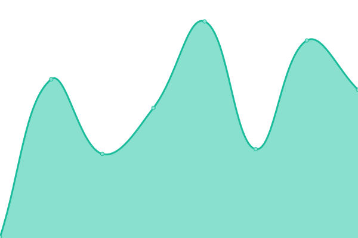
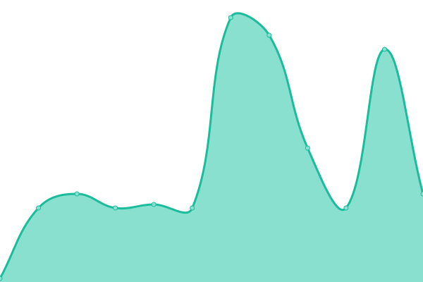

# [📈 Live Status](https://diegofcornejo.github.io/status): <!--live status--> **🟧 Partial outage**

This repository contains the open-source uptime monitor and status page for [Diego Cornejo](https://diegocornejo.com), powered by [Upptime](https://github.com/upptime/upptime).

With [Upptime](https://upptime.js.org), you can get your own unlimited and free uptime monitor and status page, powered entirely by a GitHub repository. We use [Issues](https://github.com/diegofcornejo/status/issues) as incident reports, [Actions](https://github.com/diegofcornejo/status/actions) as uptime monitors, and [Pages](https://diegofcornejo.github.io/status) for the status page.

<!--start: status pages-->
<!-- This summary is generated by Upptime (https://github.com/upptime/upptime) -->
<!-- Do not edit this manually, your changes will be overwritten -->
<!-- prettier-ignore -->
| URL | Status | History | Response Time | Uptime |
| --- | ------ | ------- | ------------- | ------ |
|  [Diego Cornejo](https://diegocornejo.com) | 🟩 Up | [diego-cornejo.yml](https://github.com/diegofcornejo/status/commits/HEAD/history/diego-cornejo.yml) | 

 1049ms
     
 | 

<a href="https://status.diegocornejo.com/history/diego-cornejo">100.00%</a>
    

|  [Diego Cornejo's Blog](https://blog.diegocornejo.com) | 🟩 Up | [diego-cornejo-s-blog.yml](https://github.com/diegofcornejo/status/commits/HEAD/history/diego-cornejo-s-blog.yml) | 

 49ms
     
 | 

<a href="https://status.diegocornejo.com/history/diego-cornejo-s-blog">100.00%</a>
    

|  [Evolution YGO - Web](https://evolutionygo.com) | 🟩 Up | [evolution-ygo-web.yml](https://github.com/diegofcornejo/status/commits/HEAD/history/evolution-ygo-web.yml) | 

 2097ms
     
 | 

<a href="https://status.diegocornejo.com/history/evolution-ygo-web">100.00%</a>
    

|  [Evolution YGO - API](https://evolutionygo.com/api/rooms) | 🟥 Down | [evolution-ygo-api.yml](https://github.com/diegofcornejo/status/commits/HEAD/history/evolution-ygo-api.yml) | 

 18ms
     
 | 

<a href="https://status.diegocornejo.com/history/evolution-ygo-api">0.00%</a>
    

|  [Evolution YGO - WSS](server.evolutionygo.com) | 🟩 Up | [evolution-ygo-wss.yml](https://github.com/diegofcornejo/status/commits/HEAD/history/evolution-ygo-wss.yml) | 

 54ms
     
 | 

<a href="https://status.diegocornejo.com/history/evolution-ygo-wss">100.00%</a>
    

|  [Lora Packet Decoder](https://lora-packet.vercel.app) | 🟩 Up | [lora-packet-decoder.yml](https://github.com/diegofcornejo/status/commits/HEAD/history/lora-packet-decoder.yml) | 

 931ms
     
 | 

<a href="https://status.diegocornejo.com/history/lora-packet-decoder">100.00%</a>
    

|  [Jupyter Lite](https://jupyter.diegocornejo.com) | 🟩 Up | [jupyter-lite.yml](https://github.com/diegofcornejo/status/commits/HEAD/history/jupyter-lite.yml) | 

 173ms
     
 | 

<a href="https://status.diegocornejo.com/history/jupyter-lite">100.00%</a>
    

<!--end: status pages-->

[**Visit our status website →**](https://diegofcornejo.github.io/status)

## 📄 License

- Powered by: [Upptime](https://github.com/upptime/upptime)
- Code: [MIT](./LICENSE) © [Diego Cornejo](https://diegocornejo.com)
- Data in the `./history` directory: [Open Database License](https://opendatacommons.org/licenses/odbl/1-0/)
